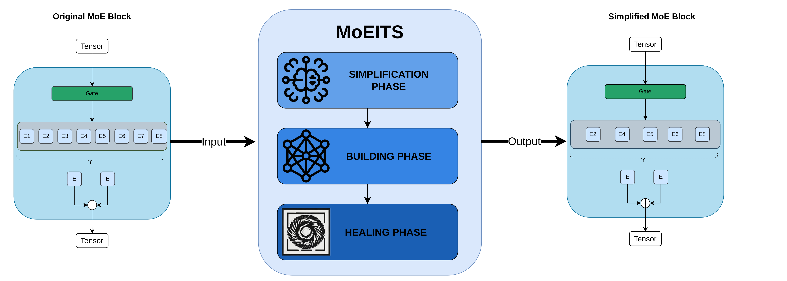

# MoEITS: A Green AI approach for simplifying MoE-LLMs

[](https://doi.org/10.5281/zenodo.xxxxxxx)
[](https://www.gnu.org/licenses/gpl-3.0)

**MoEITS is a novel pruning methodology for Mixture of Experts Large Language Models (MoE-LLMs) that simplifies architectures while maintaining performance through targeted healing.**

<p align="center">
  
</p>

This repository contains the official implementation of MoEITS and the code necessary to reproduce all methods and results presented in our submission to *Open Research Europe*.

## 📂 Repository Structure

* `src/moeits/`: Core MoEITS package. Contains the pruning algorithms and model redefinitions (modifications to standard Transformer architectures).
* `app/`: Main execution entry points for running the pruning pipeline. Includes configurations for base models, simplification levels, and operational modes.
* `training/`: Scripts for the "healing" phase, utilizing Parameter-Efficient Fine-Tuning (PEFT/LoRA) to recover model performance post-pruning.
* `evals/`: Evaluation pipeline integrating the Language Model Evaluation Harness (`lm_eval`) to benchmark pruned and healed models.
* `test/`: Unit tests validating the functionality of individual model simplification modules.
* `assets/`: Contains figures and diagrams, including the MoEITS workflow.
* `pyproject.toml`: Python package configuration and dependency management.


## 📂 Repository Structure

1. Clone this repository

```bash
git clone [https://github.com/](https://github.com/)[yourusername]/MoEITS.git
cd MoEITS
```

2. (Optional but recommended) Create a virtual environment:
```bash
python -m venv venv
source venv/bin/activate
```

3. Install the moeits package and all dependencies:
```bash
pip install -e .
```

4. Run unit tests to verify the installation:
```bash
pytest test/
```

## 📊 Data Availability

**No proprietary data is required to run this code.** The "healing" (fine-tuning) phase of MoEITS utilizes a specific subset of the publicly available **OpenHermes** dataset to recover model performance after pruning. 

To ensure strict reproducibility and permanent archiving, the exact data subset used in our experiments has been deposited in Zenodo.

* **Zenodo Archive (Experiment Subset):** [](https://doi.org/10.5281/zenodo.19535551)
* **Original Dataset:** OpenHermes 2.5 (`teknium/OpenHermes-2.5` on Hugging Face)
* **Original Source:** [https://huggingface.co/datasets/teknium/OpenHermes-2.5](https://huggingface.co/datasets/teknium/OpenHermes-2.5)
* **License:** Apache 2.0


## 🚀 Reproducing the Results

To reproduce the methodology and results found in the paper, execute the pipeline in the following order:

1. Model Pruning

Execute the main application to prune the target MoE model to the desired simplification level.

```bash
python app/main.py --model "mistralai/Mixtral-8x7B-v0.1" --simplify_level 0.5 --mode prune --output_dir ./pruned_models/mixtral_0.5
```

2. Model Healing (PEFT / LoRA)

Recover the performance of the pruned model using the OpenHermes dataset.

```bash
python training/heal_model.py --model_path ./pruned_models/mixtral_0.5 --dataset "teknium/OpenHermes-2.5" --epochs 3 --output_dir ./healed_models/mixtral_0.5_healed
```

3. Evaluation

Run the standard evaluation benchmarks using lm_eval to generate the performance metrics reported in our tables.

```bash
python evals/run_evals.py --model_path ./healed_models/mixtral_0.5_healed --tasks "arc_challenge,hellaswag,mmlu" --batch_size auto
```

## 📜 License

This project is licensed under the GPL v3 License - see the LICENSE file for details.

## 🖋️ Citation

If you use MoEITS in your research, please cite our paper:

```bash
@article{balderas2026-moeits,
  title={[Paper Title]},
  author={[Author List]},
  journal={Open Research Europe},
  year={[Year]},
  doi={[DOI of the published paper]}
}
```